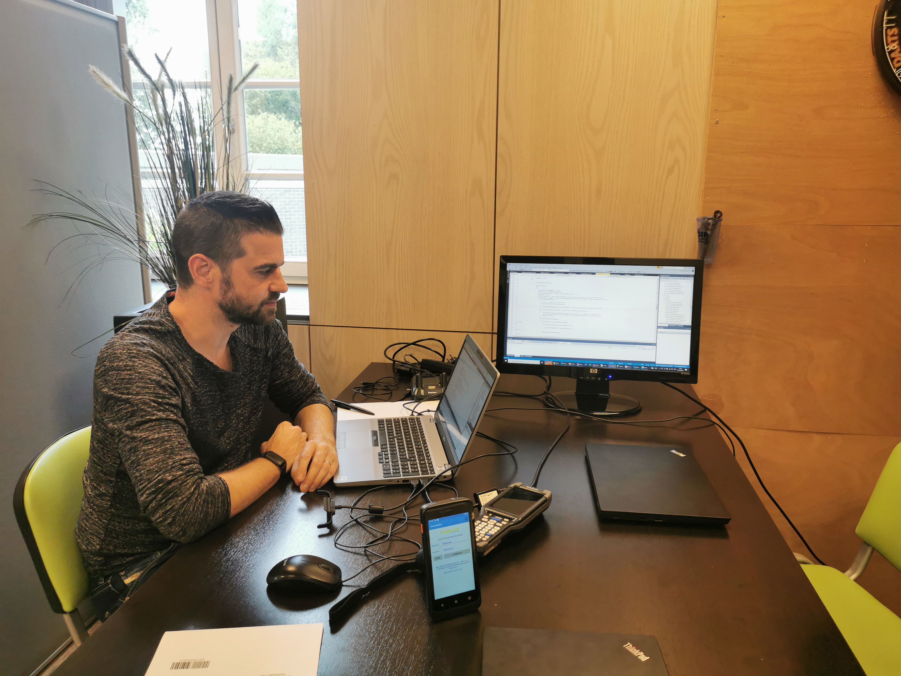

 

# Dagverslagen
* [Dagverslag 1](#2021-10-04)
* [Dagverslag 2](#2021-10-05)
* [Dagverslag 3](#2021-10-06)
* [Dagverslag 4](#2021-10-07)
* [Dagverslag 5](#2021-10-08)

## ***Dagverslag 1***

### 2021-10-04 ###

*Vandaag was de eerste dag dat ik naar het [TCOG](https://www.tcog.be/) in Turnhout ging, voor de observatie-stage. Toen ik aankwam dacht ik eerst dat het helemaal niet een softwarebedrijf was, door de rustieke villa waar het bedrijf in zit, gelukkig bleef het niet lang zo.*

 
 

Ik werd vriendelijk ontvangen en kreeg direct uitleg over het bedrijf. Toen ik uitleg kreeg over wat het bedrijf deed, sinds ik nog niet echt exact wist wat [ERP](https://nl.wikipedia.org/wiki/Enterprise_resource_planning) was, ben ik meteen geïnteresseerd geraakt, omdat het bijna **helemaal** software gericht was.

Ik kreeg een rondleiding en vond hun manier van werken slim bedacht, de programmeurs zaten samen in de **boven verdieping** om snel met elkaar te kunnen communiceren en de helpdesk zat **beneden** waar ze met elkaar snel kunnen overleggen voor hun client en met hun client.

Het was een rustige dag, maar voor de programmeurs was het deze morgent wel druk. Het bedrijf [Acco](https://acco.be/) had een ***datacommunicatieprobleem*** waardoor de bestellingen van studenten niet door naar de volgende fase geraakte, gelukkig begon het in de middag vlotter te gaan, maar het is nog altijd niet opgelost.

De helpdesk waar ik zat had 3 nieuwe cases vandaag en hadden er 4 opgelost. Ze vertelde me dat ze gemiddeld 8 cases hebben, maar vandaag was het dus een rustige dag.

 

***Mijn vragen voor morgen zullen zijn:***

- Is het probleem opgelost met Acco?

- Als het nee is: Wat is de status?

- Wat als Jira uitvalt

- Business Central is wat?

- Verschil tussen TeamViewer en Microsoft NAV?

 

 > Ik was vergeten een foto te nemen van de buitenkant dus heb ik ze van deze [link](https://www.tcog.be/over-ons/) genomen

 
 
 

# ***Dagverslag 2*** #
### 2021-10-05 ###

 

*De dag was gestart met een autorit naar Antwerpen om een klant van het TCOG te feliciteren, omdat de klant [Co Concept](https://www.co-concept.be/contact) is. Ze zijn al 15 jaar bij TCOG en eigenlijk nog langer als je de [vorige namen](https://www.tcog.be/over-ons/) van TCOG meetelt.*

 

Natuurlijk was het niet alleen een autorit om het bedrijf te feliciteren, het doel was om te praten over een eventuele upgrade naar **Business Central** omdat ze nog een **oude Navision** gebruikte en Navision wordt ***niet meer ge support door Microsoft***. Een andere reden is om de klant bij hun te houden, dit is dun een van hun technieken dat ik wel interessant vond.

 
 
> "Als je ze een cadeau geeft worden ze blij en willen ze volgenden keer weer een cadeau" **-Laurens** (Persoon waar we mee waren)

Hierdoor is het dus **moeilijker** voor andere bedrijven om een offer te doen aan bedrijven die samen werken met TCOG.

In de namiddag, ben ik terug bij de helpdesk gaan zitten. Ik werd geïnformeerd dat het Acco probleem nog lang niet opgelost zal zijn. Voor de rest ben ik voor de eerste keer bij een *senior programmeur* geweest en hij legde mij uit waar en hoe hij aan projecten werkt. De dag eindigde weer op de helpdesk, waar ik rustig al wat voor de GIP taak kon werken.

 
 
 

> Het kantoor van Co Concept

 
 

> plaats waar we het gesprek hebben gehad met de programmeur over [Azure](https://azure.microsoft.com/nl-nl/) en [DevOps](https://azure.microsoft.com/nl-nl/overview/what-is-devops/)

 

***Mijn vragen voor morgen zullen zijn:***

- Wat is de status van Acco?

- Van plan om naar GitHub ooit te gaan, inplaats DevOps?

 
 
 

# ***Dagverslag 3*** #
### 2021-10-06 ###

 

*Vandaag ben ik de dag begonnen met een kennismaking samen met het marketing team, we hadden een kort gesprek over hoe de site gemaakt werd en hoe TCOG contact probeert te houden met hun klanten.*

 

Ze houden contact met hun klanten door op hun site door [nieuwsartikelen](https://www.tcog.be/nieuws/) over ***Business Central*** (om hun te overtuigen voor ene updrage te gaan) te vertalen naar het ***Nederlands*** en [webinairs](https://nl.wikipedia.org/wiki/Webinar) te maken. De marketing zijn ook dezelfde mensen die de pakjes voor klanten maken.  
Na dit hebben we vlak voor de middag een meeting gehad met ***een van oprichters van TCOG***, hij deed de financiering en IT. Natuurlijk was ik er voor de IT, hij was gespecialiseerd in [Azure](https://azure.microsoft.com/nl-nl/) en [Power BI](https://powerbi.microsoft.com/nl-nl/). Hij deed een zeer gedetailleerde uitleg van **1 uur** hierover! 

> Meeting met Peter Bertels, een van de oprichters

 
 

Na de zeer informatieve voormiddag, kwam een van de programmeurs naar beneden. We hebben samen ***2 uur uitleg gekregen*** over wat hij aan het doen was en beantwoorde heel gedetailleerde de vragen die ik had.  
Hij schreef in [AL](https://docs.microsoft.com/en-us/dynamics365/business-central/dev-itpro/developer/devenv-programming-in-al) en werkte hier al mee voor 2 jaar.
Hij gaf ook uitleg hoe hij bij het TCOG was geraakt, je kunt er starten met een beetje basis van IT, maar moet je wel 6 maanden een self-cursus doen.

> Samen bezig aan de code met de programmeur waar ik bij zat

 

***Mijn vragen voor morgen zullen zijn:***

- Acco status

 
 
 

# ***Dagverslag 4*** #
### 2021-10-07 ###

 

*Het was vandaag enrom rustig op de helpdesk, met dat bedoel ik dan ook dat we 0 "cases" hadden. Ik heb vooral geprobeerd wat meer vragen te stellen en wat gewerkt aan een zelfstudie.*

 

We hebben veel zelf studie moeten doen wat niet erg was, want ik leer en meer over wat ze aan het doen zijn en ik kan dan beter meevolgen als er een case is.

In de namiddag hebben we een gesprek gehad met een programmeur die vroeger in een groote bedrijf heeft gewerkt, maar overgeshakelt is naar het TCOG. Zijn uitleg was zeer interessant. Hij maakt met een programmeertaal een app voor scanners met een Android OS, waarmee hij dan een specifieke app maakt voor een klant.

 
 
 

# ***Dagverslag 5*** #
### 2021-10-08 ###

 

*De laatste dag bij TCOG begon met Thomas en ik die voor de werknemers **chocolades** had gekocht, daarna namen ze een foto van ons ze stuurde zo een mail naar heel het bedrijf dat we ze bedankte!*

 

Terug naar de IT, vandaag had ik veel bijgeleerd over de *essentiële* behoefte van Powershell in het server-management van het bedrijf. Ik heb hiervan meer dan ***4 uur uitleg over gekregen!***

Hierna werden onze notities nog nagekeken door dezelfde persoon waar we de uitleg over gekregen hadden en met die info kan ik nu verder opweeg voor mijn case studie. 
Het was een geweldige ervaring om een bedrijf eens mogen mee te volgen en voelde me er direct welkom van het moment dat ik aankwam, tot het einde! 

 

>De werkplaats van de persoon die met Powershell werkt.

 

*Zelf gaat het een moeilijke keuze worden of ik er later nog eens een stage ga doen, omdat ze vooral niet op 1 ding focussen, maar heel uitgebreid zijn, niemand doet maar 1 dezelfde job. Voor mij zou dit dan niet ideaal zijn, omdat ik zeer geintereseerd ben in programmeren zelf, maar wie weet veranderd mijn mening ooit nog.*